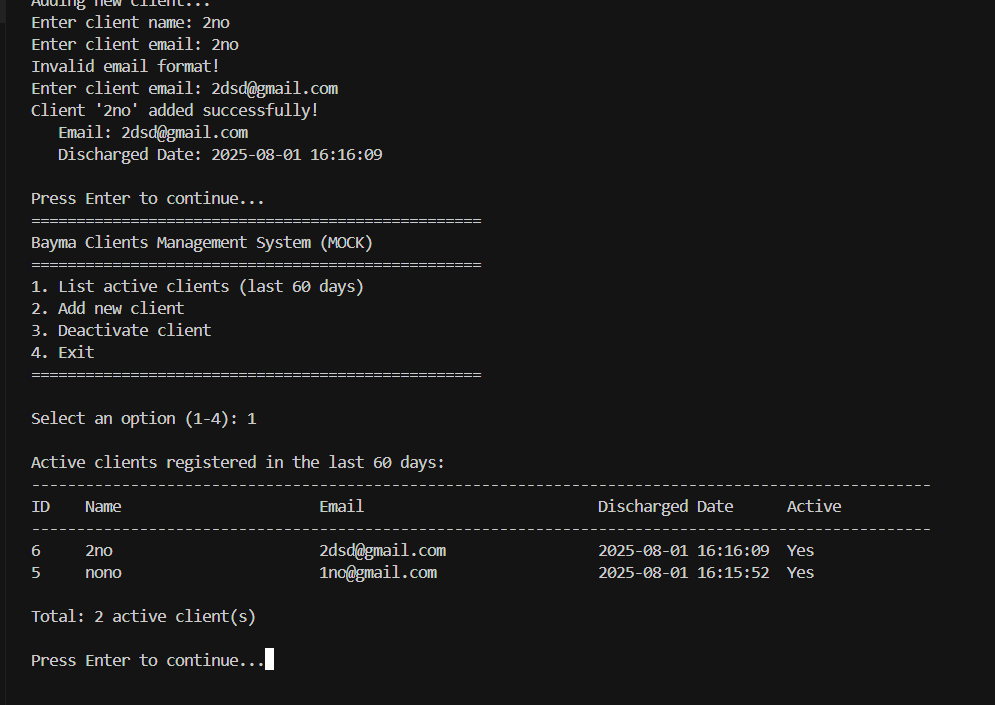
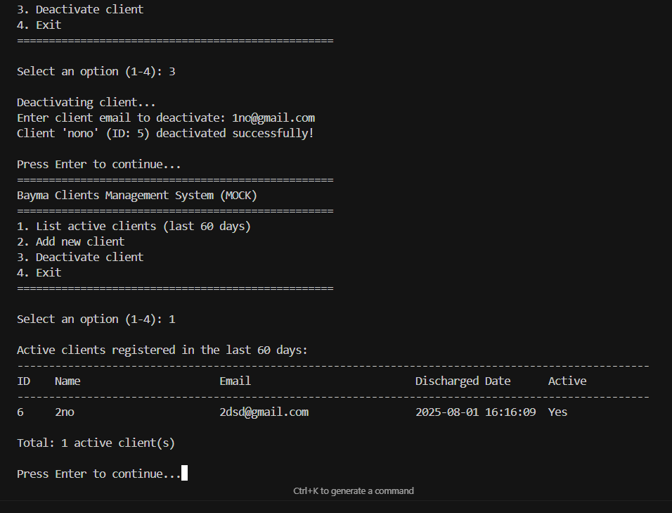

# Bayma Clients Management System

A modular Python script for managing clients in the `clientes_bayma` MySQL database.

### Installation

1. **Install dependencies:**
   ```bash
   pip install -r requirements.txt
   ```

2. **Configure database connection** in `config.py`:
   ```python
   DB_CONFIG = {
       'host': 'localhost',
       'user': 'root',
       'password': '',
       'database': 'clientes_bayma'
   }
   ```

3. **Run the application:**
   ```bash
   python bayma_clients.py
   ```

## Module Documentation

### `config.py`
Contains all configuration settings:
- Database connection parameters
- Application constants and messages
- Menu options and display settings
- Column widths for table formatting

### `queries.py`
Centralized SQL queries:
- `ClientQueries.LIST_ACTIVE_CLIENTS_60_DAYS`
- `ClientQueries.INSERT_NEW_CLIENT`
- `ClientQueries.DEACTIVATE_CLIENT`
- Additional utility queries

### `utils.py`
Utility functions for:
- Input validation (email, name)
- Table formatting and display
- User input handling
- Date calculations and timestamp formatting

### `bayma_clients.py`
Main application class `BaymaClientsManager`:
- Database connection management
- Core business logic
- Menu-driven interface
- Error handling

## Testing

Run the mock version without database:
```bash
python test_script.py
```

## Usage Examples

### Starting the Application
```
Starting Bayma Clients Management System...
Successfully connected to MySQL database!

==================================================
Bayma Clients Management System
==================================================
1. List active clients (last 60 days)
2. Add new client
3. Deactivate client
4. Exit
==================================================

Select an option (1-4): 1
```

### Listing Active Clients
```
Active clients registered in the last 60 days:
----------------------------------------------------------------------------------------------------
ID    Name                     Email                          Discharged Date        Active
----------------------------------------------------------------------------------------------------
3     John Doe                 john.doe@example.com          2024-01-15 14:30:25   Yes
2     Jane Smith               jane.smith@company.com        2024-01-10 09:15:42   Yes
1     Bob Johnson              bob.johnson@test.com          2024-01-05 16:45:18   Yes

Total: 3 active client(s)
```

### Adding a New Client
```
Adding new client...
Enter client name: Alice Brown
Enter client email: alice.brown@email.com
Client 'Alice Brown' added successfully!
   Email: alice.brown@email.com
   Discharged Date: 2024-01-20 15:30:45
```

### Deactivating a Client
```
Deactivating client...
Enter client email to deactivate: john.doe@example.com
Client 'John Doe' (ID: 3) deactivated successfully!
```

## Security Features

- **Parameterized Queries**: Prevents SQL injection
- **Input Validation**: Email format and data integrity
- **Error Handling**: Comprehensive exception management
- **Connection Management**: Proper database connection lifecycle

## Error Handling

The application handles:
- Database connection failures
- Invalid user input
- Duplicate email addresses
- Non-existent clients
- Already deactivated clients
- SQL execution errors

## Real screenshots

