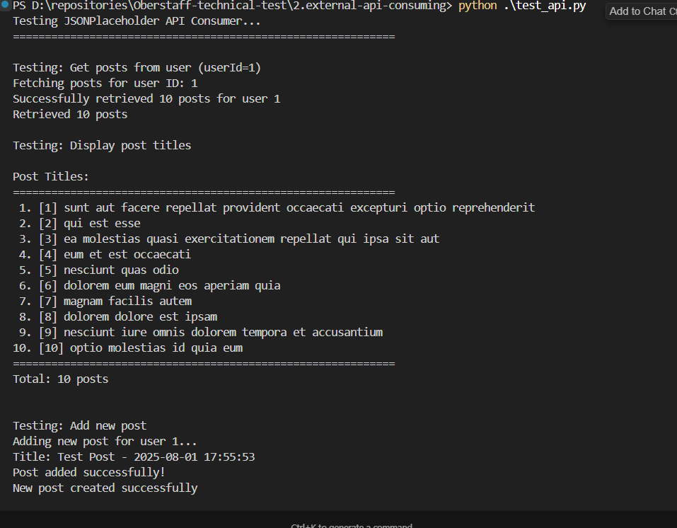
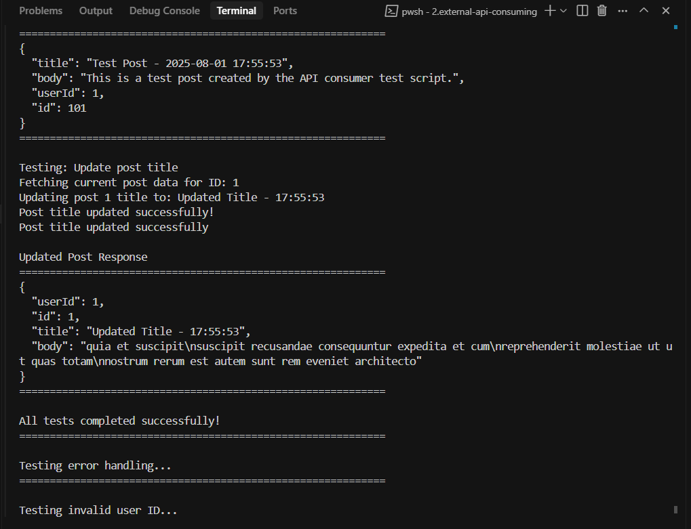
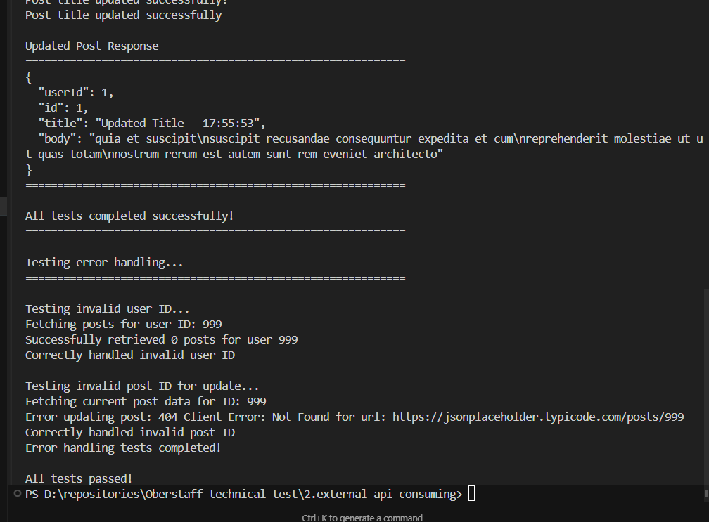

# External API Consumer

A Python application that demonstrates consuming the JSONPlaceholder API with interactive features.

## Overview

This project provides a command-line interface to interact with the JSONPlaceholder API, allowing users to:
- Fetch posts by user ID
- Add new posts
- Update existing post titles
- Run automated demos

## Installation

1. Install dependencies:
```bash
pip install -r requirements.txt
```

## Usage

Run the application:
```bash
python api_consumer.py
```
## API Endpoints Used

- `GET /posts?userId={id}` - Fetch posts by user ID
- `POST /posts` - Create new post
- `PUT /posts/{id}` - Update existing post

## Configuration

Edit `config.py` to modify:
- Base API URL
- Default user ID
- Request headers
- Menu options

## Testing

Run the test suite:
```bash
python test_api.py
```

## Dependencies

- `requests==2.31.0` - HTTP library for API calls


## Real screenshots


