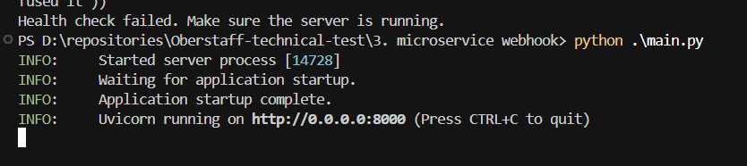
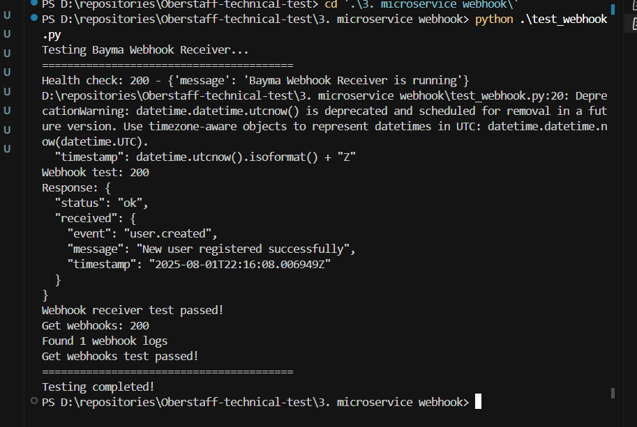
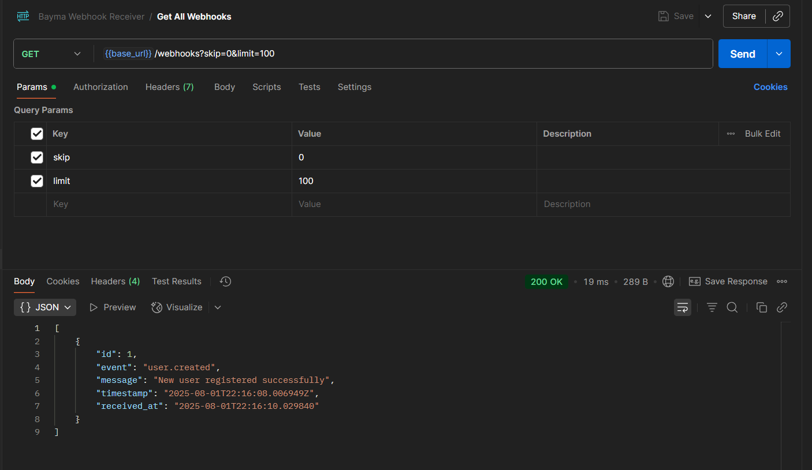
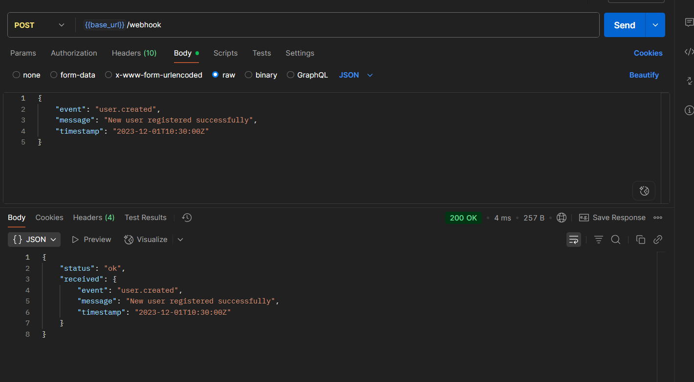

# Bayma Webhook Receiver

A FastAPI-based microservice for receiving and logging webhook notifications with in-memory storage.

## Quick Start

1. Install dependencies:
```bash
pip install -r requirements.txt
```

2. Start the server:
```bash
python main.py
```

3. Test the webhook:
```bash
python test_webhook.py
```

## API Endpoints

### Health Check
```
GET /
```

### Webhook Receiver
```
POST /webhook
```

**Request:**
```json
{
    "event": "user.created",
    "message": "New user registered",
    "timestamp": "2023-12-01T10:30:00Z"
}
```

**Response:**
```json
{
    "status": "ok",
    "received": {
        "event": "user.created",
        "message": "New user registered",
        "timestamp": "2023-12-01T10:30:00Z"
    }
}
```

### Get Webhook Logs
```
GET /webhooks?skip=0&limit=100
```

### Get Specific Webhook
```
GET /webhooks/{webhook_id}
```

## Testing

Make sure the server is running before executing tests.


# Real Screenshots




